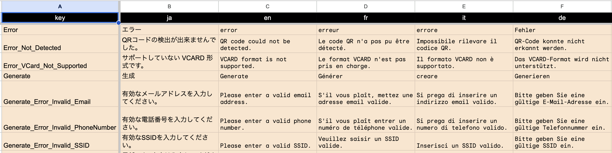
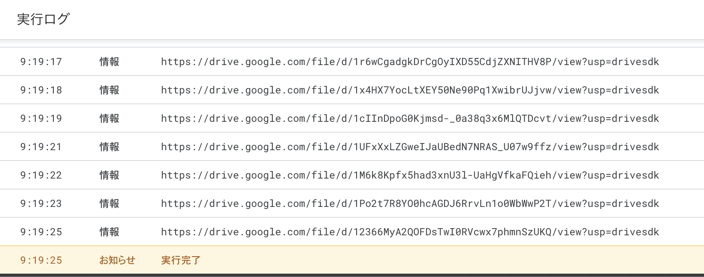

# google-spreadsheet-to-resx

このスクリプトは MAUI で使用するローカライズテキストファイル（*.resx）を Google スプレッドシートから生成します。

## 簡単な仕様説明

- Google スプレッドシートからローカライズ対象のテキストを読み込む
- スプレッドシートの最初の行には言語コードを指定する
  - 最初の列はテキストのキー、それ以降に続く列に言語コードを並べる
- スプレッドシート内のシート名がファイル名となる
  - 例えば、シート名が`StringTable`の場合、日本語の resx のファイル名は`StringTable.ja.resx`となります。
- 生成されたファイルは Google ドライブに保存される

## 使用方法

### ResX ファイルの生成

以下の画像のように先頭の行にキー列と、翻訳対象の言語の言語コードを並べたスプレッドシートを用意します。

次にメニュー > 拡張機能 > Apps Script をクリックします。

Apps Script のエディターが開きますので、`ExportToResX.gs` の内容を貼り付けます。
プロジェクト名やファイル名は任意で設定して貰えば良いです。

ファイルを保存し、上部の「実行」ボタンをクリックします。
そうすると下部にコンソールが開き、実行ログが表示されます。
実行ログには、保存先の Google ドライブのリンクが表示されます。

