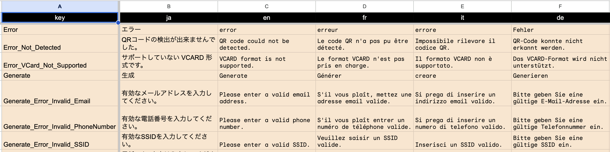
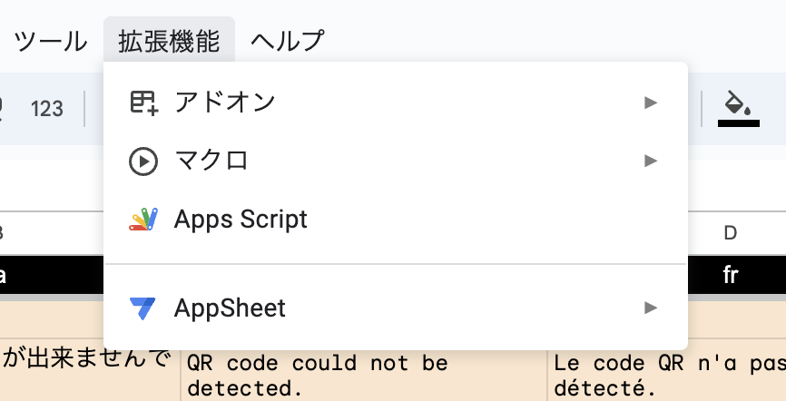
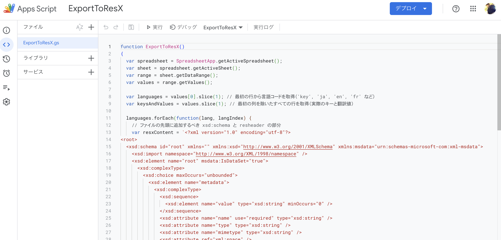
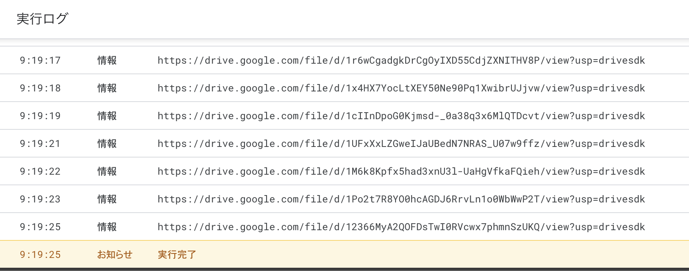

# google-spreadsheet-to-resx

[日本語](README.ja.md)

This script generates a localized text file (*.resx) from a Google spreadsheet for use in MAUI.

## Brief specification explanation

- Load text to be localized from a Google spreadsheet
- Specify the language code in the first row of the spreadsheet
  - The first column is the key of the text, and the subsequent columns are the language codes
- The sheet name in the spreadsheet becomes the file name
  - For example, if the sheet name is `StringTable`, the file name of the Japanese resx will be `StringTable.ja.resx`.
- The generated file will be saved in Google Drive.

## Usage

### Generating ResX Files

Prepare a spreadsheet with the key columns in the first row and the language code of the language to be translated, as shown in the following image.

Then click on Menu > Extensions > Apps Script.

The Apps Script editor will open, paste the contents of `ExportToResX.gs`.
The project name and file name can be set arbitrarily.

Save the file and click the "Run" button at the top.
A console will then open at the bottom and the execution log will be displayed.
The execution log will show a link to the Google Drive where the file was saved.

